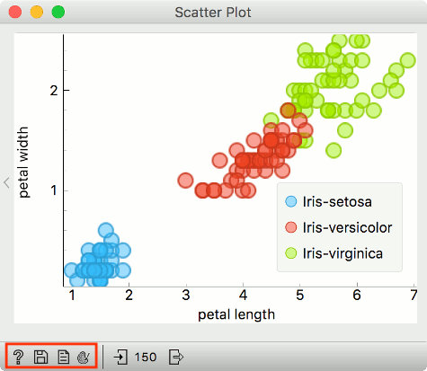
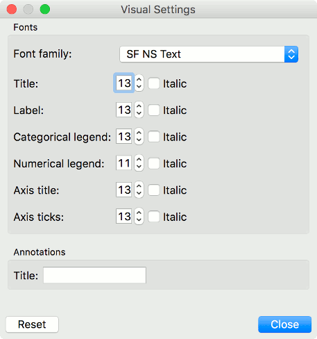

# Exporting Visualizations

Visualizations are an essential part of data science and analytical reports are incomplete without them. Orange provides a couple of options for saving and modifying visualizations.

At the bottom of each widget there is a status bar. Visualization widgets have a Save icon (second from the left) and a Palette icon (fourth from the left). Save icon saves the plot to the computer. Palette icon opens a dialogue for modifying visualizations.



## Saving a plot

Visualizations in Orange can be saved in several formats, namely .png, .svg, .pdf, .pdf from matplotlib and as a matplotlib Python code. A common option is saving in .svg (scalable vector graphic), which you can edit with a vector graphics software such as [Inkscape](https://inkscape.org/). Ctrl+C (cmd+C) will copy a .png plot, which you can import with ctrl+V (cmd+V) into Word, PowerPoint, or other software tools.


[Matplotlib](https://matplotlib.org/) Python code is ideal for detailed editing and a high level of customization. Below is an example of the Python code. It is possible to adjust the colors, size of the symbols, markers, etc.

```python
import matplotlib.pyplot as plt
from numpy import array

plt.clf()

# data
x = array([1.4, 1.4, 1.3, 1.5, 1.4])
y = array([0.2, 0.7, 0.9, 0.2, 0.1])
# style
sizes = 13.5
edgecolors = ['#3a9ed0ff', '#c53a27ff']
edgecolors_index = array([0, 0, 1, 1, 1], dtype='int')
facecolors = ['#46befa80', '#ed462f80']
facecolors_index = array([0, 0, 1, 1, 1], dtype='int')
linewidths = 1.5
plt.scatter(x=x, y=y, s=sizes**2/4, marker='o',
            facecolors=array(facecolors)[facecolors_index], 
            edgecolors=array(edgecolors)[edgecolors_index],
            linewidths=linewidths)
plt.xlabel('petal length')
plt.ylabel('petal width')

plt.show()
```

## Modifying a plot

It is possible to modify certain parameters of a plot without digging into the code. Click on the Palette icon to open visual settings. One can change various attributes of the plot, such as fonts, font sizes, titles and so on.


