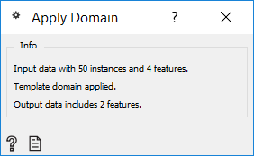
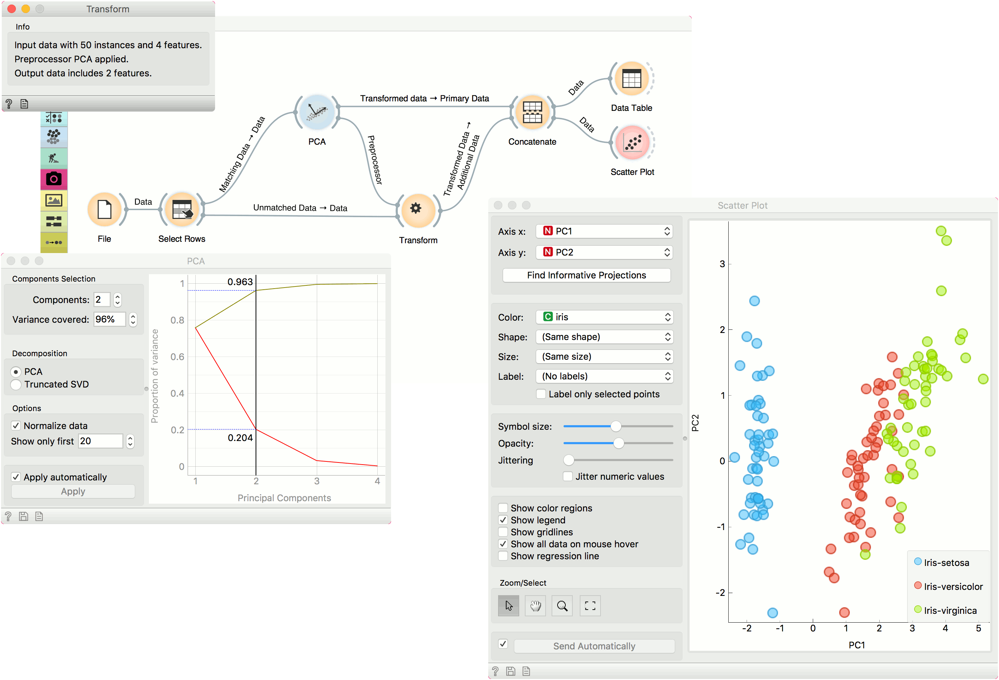

Apply Domain
============

Given dataset and preprocessor transforms the dataset.

**Inputs**

- Data: input dataset
- Preprocessor: preprocessor for transformation

**Outputs**

- Transformed Data: transformed dataset

**Apply Domain** maps new data into a transformed space. For example, if we transform some data with PCA and wish to observe new data in the same space, we can use transform to map the new data into the PCA space created from the original data.

Widget accepts new data on the input and a preprocessor that was used to transform the old data.

Example
-------

We will use iris data from the [File](../data/file.md) widget for this example. To create two separate data sets, we will use [Select Rows](../data/selectrows.md) and set the condition to *iris is one of iris-setosa, iris-versicolor*. This will output a data set with a 100 rows, half of them belonging to iris-setosa class and the other half to iris-versicolor.

We will transform the data with [PCA](../unsupervised/PCA.md) and select the first two components, which explain 96% of variance. Now, we would like to apply the same preprocessing on the 'new' data, that is the remaining 50 iris virginicas. Send the unused data from **Select Rows** to **Apply Domain**. Make sure to use the *Unmatched Data* output from **Select Rows** widget. Then add the *Preprocessor* output from **PCA**.

**Apply Domain** will apply the preprocessor to the new data and output it. To add the new data to the old data, use [Concatenate](../data/concatenate.md). Use *Transformed Data* output from **PCA** as *Primary Data* and *Transformed Data* from **Apply Domain** as *Additional Data*.

Observe the results in a [Data Table](../data/datatable.md) or in a [Scatter Plot](../visualize/scatterplot.md) to see the new data in relation to the old one.

