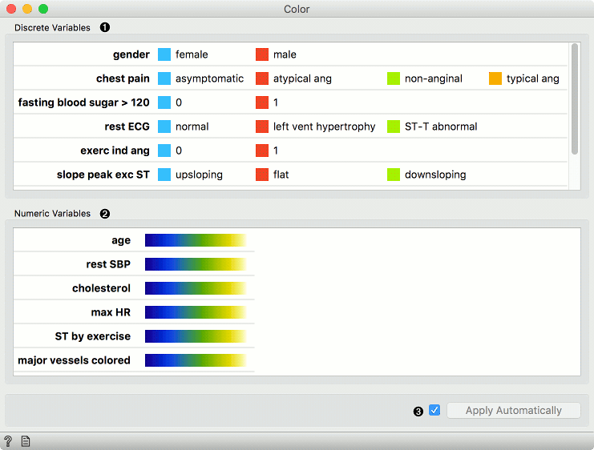

Color
=====

Set color legend for variables.

**Inputs**

- Data: input data set

**Outputs**

- Data: data set with a new color legend

The **Color** widget sets the color legend for visualizations.

1. A list of discrete variables. Set the color of each variable by double-clicking on it. The widget also enables renaming variables by clicking on their names.
2. A list of continuous variables. Click on the color strip to choose a different palette. To use the same palette for all variables, change it for one variable and click *Copy to all* that appears on the right. The widget also enables renaming variables by clicking on their names.
3. Produce a report.
4. Apply changes. If *Apply automatically* is ticked, changes will be communicated automatically. Alternatively, just click *Apply*.

Palettes for numeric variables are grouped and tagged by their properties.

- Diverging palettes have two colors on its ends and a central color (white or black) in the middle. Such palettes are particularly useful when the the values can be positive or negative, as some widgets (for instance the Heat map) will put the 0 at the middle point in the palette.

- Linear palettes are constructed so that human perception of the color change is linear with the change of the value.

- Color blind palettes cover different types of color blindness, and can also be linear or diverging.

- In isoluminant palettes, all colors have equal brightness.

- Rainbow palettes are particularly nice in widgets that bin numeric values in visualizations.

Example
-------

We chose to work with the *Iris* data set. We opened the color palette and selected three new colors for the three types of Irises. Then we opened the [Scatter Plot](../visualize/scatterplot.md) widget and viewed the changes made to the scatter plot.

To see the effect of color palettes for numeric variables, we color the points in the scatter plot by sepal width and change the palette for this attribute in the Color widget.

