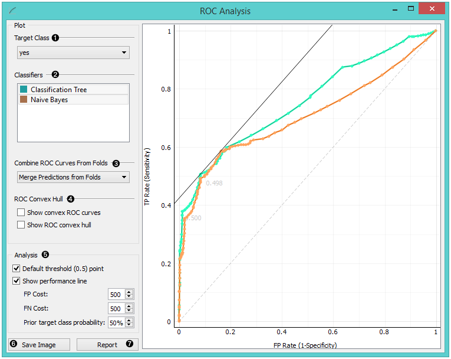
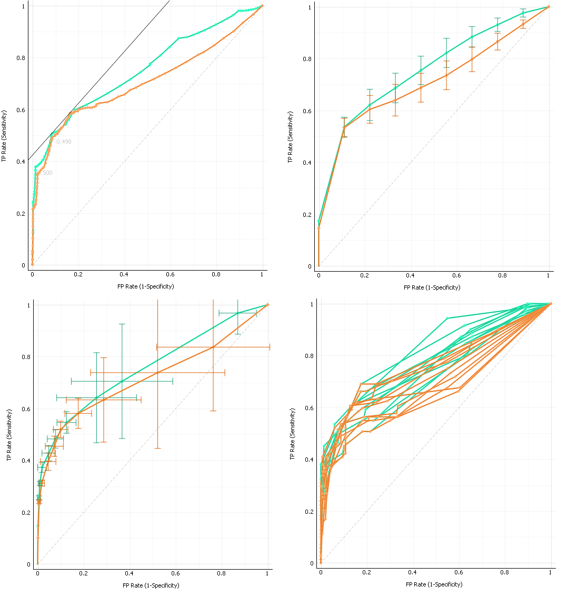
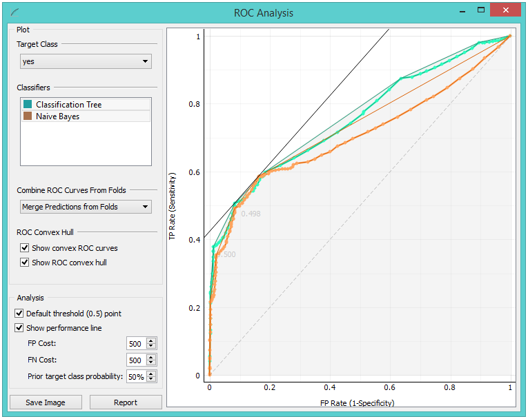
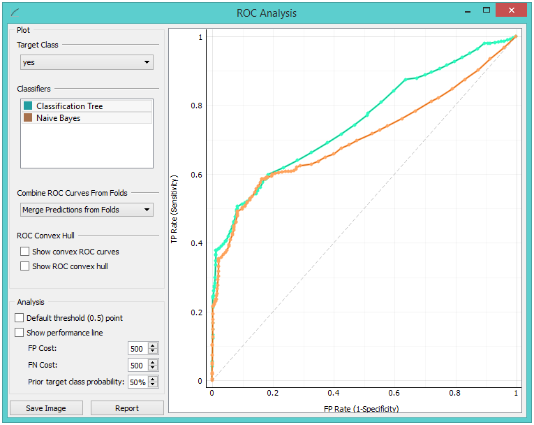
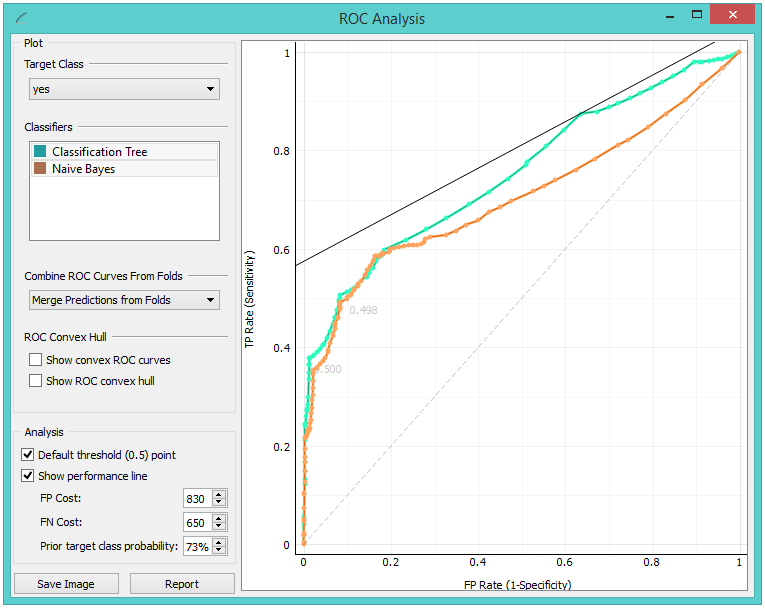
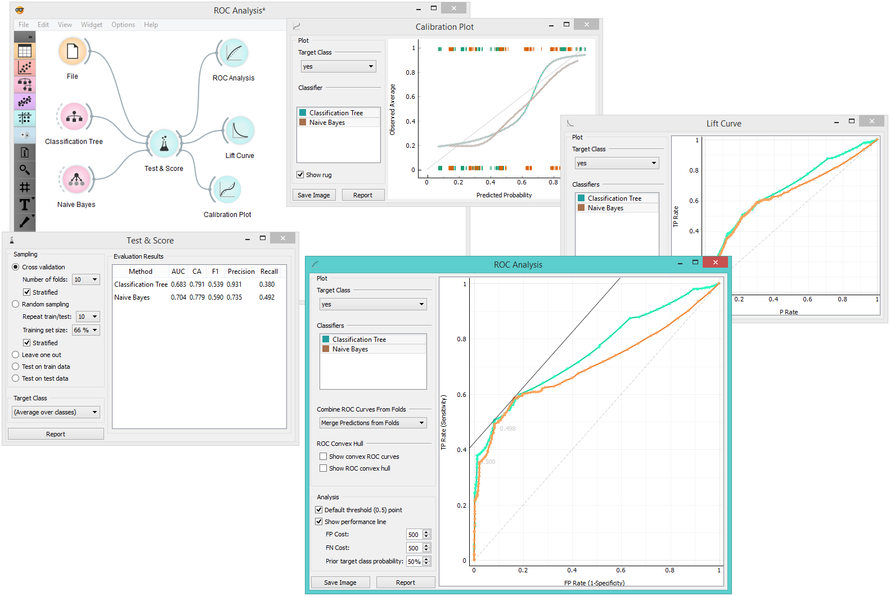

ROC Analysis
============

Plots a true positive rate against a false positive rate of a test.

**Inputs**

- Evaluation Results: results of testing classification algorithms

The widget shows ROC curves for the tested models and the corresponding convex hull. It serves as a mean of comparison between classification models. The curve plots a false positive rate on an x-axis (1-specificity; probability that target=1 when true value=0) against a true positive rate on a y-axis (sensitivity; probability that target=1 when true value=1). The closer the curve follows the left-hand border and then the top border of the ROC space, the more accurate the classifier. Given the costs of false positives and false negatives, the widget can also determine the optimal classifier and threshold.

1. Choose the desired *Target Class*. The default class is chosen alphabetically.
2. If test results contain more than one classifier, the user can choose which curves she or he wants to see plotted. Click on a classifier to select or deselect it.
3. When the data comes from multiple iterations of training and testing, such as k-fold cross validation, the results can be (and usually are) averaged.
   
   The averaging options are:
     - **Merge predictions from folds** (top left), which treats all the test data as if they came from a single iteration
     - **Mean TP rate** (top right) averages the curves vertically, showing the corresponding confidence intervals
     - **Mean TP and FP at threshold** (bottom left) traverses over threshold, averages the positions of curves and shows horizontal and vertical confidence intervals
     - **Show individual curves** (bottom right) does not average but prints all the curves instead
4. Option *Show convex ROC curves* refers to convex curves over each individual classifier (the thin lines positioned over curves). *Show ROC convex hull* plots a convex hull combining all classifiers (the gray area below the curves). Plotting both types of convex curves makes sense since selecting a threshold in a concave part of the curve cannot yield optimal results, disregarding the cost matrix. Besides, it is possible to reach any point on the convex curve by combining the classifiers represented by the points on the border of the concave region.
  
The diagonal dotted line represents the behavior of a random classifier. The full diagonal line represents iso-performance. A black "*A*" symbol at the bottom of the graph proportionally readjusts the graph.
5. The final box is dedicated to the analysis of the curve. The user can specify the cost of false positives (FP) and false negatives (FN), and the prior target class probability.

   - *Default threshold (0.5) point* shows the point on the ROC curve achieved by the classifier if it predicts the target class if its probability equals or exceeds 0.5.
   - *Show performance line* shows iso-performance in the ROC space so that all the points on the line give the same profit/loss. The line further to the upper left is better than the one down and right. The direction of the line depends upon costs and probabilities. This gives a recipe for depicting the optimal threshold for the given costs: this is the point where the tangent with the given inclination touches the curve and it is marked in the plot. If we push the iso-performance higher or more to the left, the points on the iso-performance line cannot be reached by the learner. Going down or to the right, decreases the performance.
   - The widget allows setting the costs from 1 to 1000. Units are not important, as are not the magnitudes. What matters is the relation between the two costs, so setting them to 100 and 200 will give the same result as 400 and 800.
   Defaults: both costs equal (500), Prior target class probability 50%(from the data).
    
    False positive cost: 830, False negative cost 650, Prior target
    class probability 73%.
    
6. Press *Save Image* if you want to save the created image to your
    computer in a .svg or .png format.
7. Produce a report.

Example
-------

At the moment, the only widget which gives the right type of signal needed by the **ROC Analysis** is [Test & Score](../evaluate/testandscore.md). Below, we compare two classifiers, namely [Tree](../model/tree.md) and [Naive Bayes](../model/naivebayes.md), in **Test\&Score** and then compare their performance in **ROC Analysis**, [Life Curve](../evaluate/performancecurve.md) and [Calibration Plot](../evaluate/calibrationplot.md).

