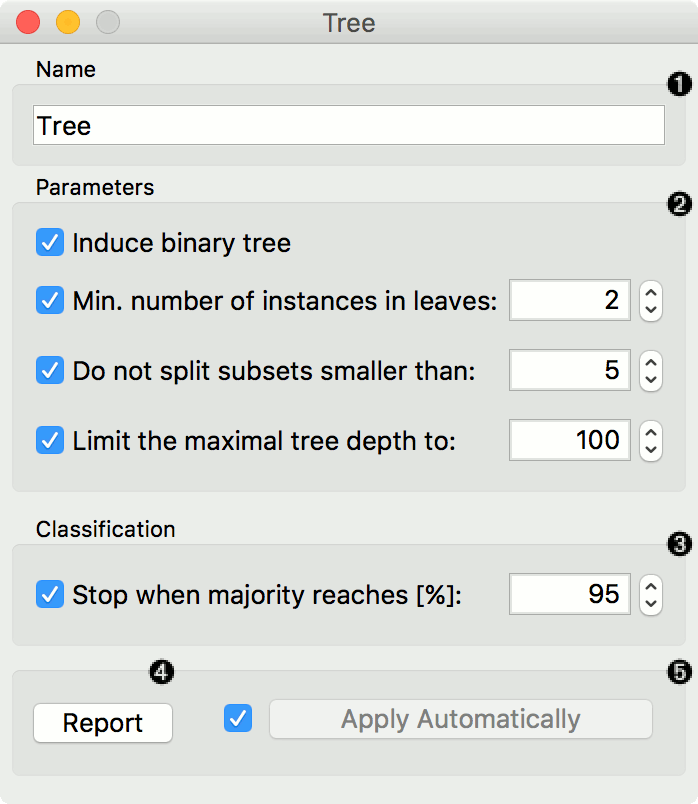
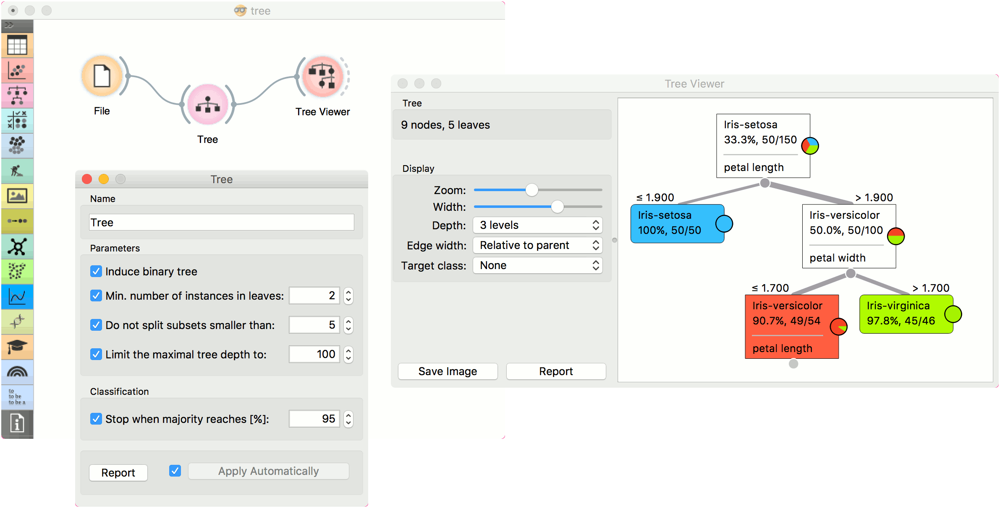
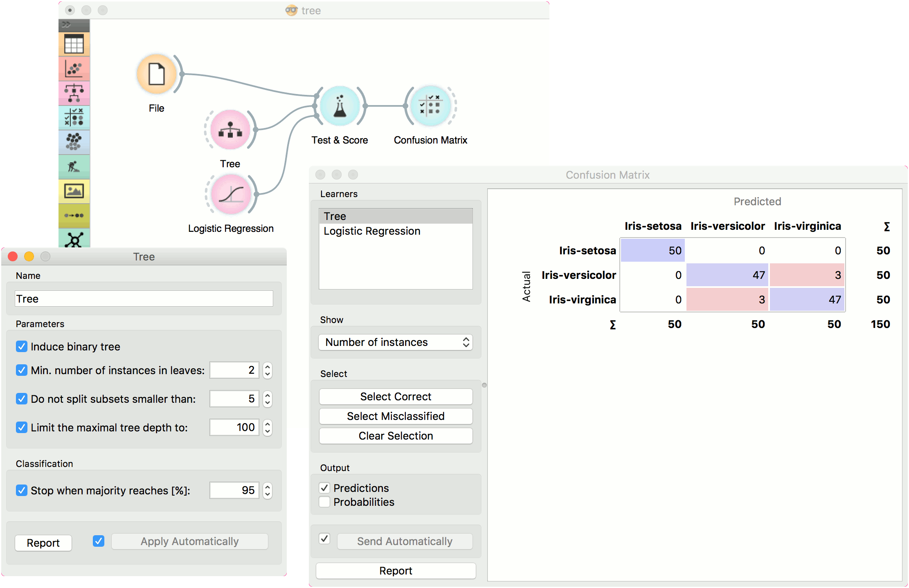
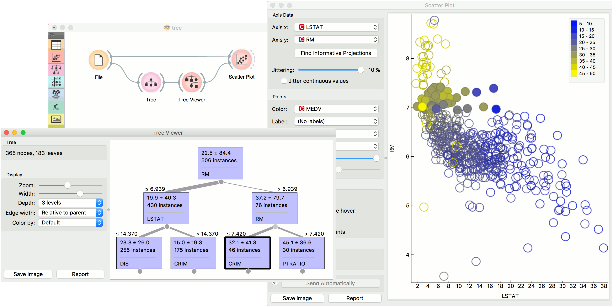

Tree
====

A tree algorithm with forward pruning.

**Inputs**

- Data: input dataset
- Preprocessor: preprocessing method(s)

**Outputs**

- Learner: decision tree learning algorithm
- Model: trained model

**Tree** is a simple algorithm that splits the data into nodes by class purity. It is a precursor to [Random Forest](../model/randomforest.md). Tree in Orange is designed in-house and can handle both discrete and continuous datasets.

It can also be used for both classification and regression tasks.

1. The learner can be given a name under which it will appear in other widgets. The default name is "Tree".
2. Tree parameters:
   - **Induce binary tree**: build a binary tree (split into two child nodes)
   - **Min. number of instances in leaves**: if checked, the algorithm will never construct a split which would put less than the specified number of training examples into any of the branches.
   - **Do not split subsets smaller than**: forbids the algorithm to split the nodes with less than the given number of instances.
   - **Limit the maximal tree depth**: limits the depth of the classification tree to the specified number of node levels.
3. **Stop when majority reaches [%]**: stop splitting the nodes after a specified majority threshold is reached
4. Produce a report. After changing the settings, you need to click *Apply*, which will put the new learner on the output and, if the training examples are given, construct a new classifier and output it as well. Alternatively, tick the box on the left and changes will be communicated automatically.

Preprocessing
-------------

Tree uses default preprocessing when no other preprocessors are given. It executes them in the following order:

- removes instances with unknown target values
- continuizes categorical variables (with one-hot-encoding)
- removes empty columns
- imputes missing values with mean values

To remove default preprocessing, connect an empty [Preprocess](../data/preprocess.md) widget to the learner.

Examples
--------

There are two typical uses for this widget. First, you may want to induce a model and check what it looks like in [Tree Viewer](../visualize/treeviewer.md).

The second schema trains a model and evaluates its performance against [Logistic Regression](../model/logisticregression.md).

We used the *iris* dataset in both examples. However, **Tree** works for regression tasks as well. Use *housing* dataset and pass it to **Tree**. The selected tree node from [Tree Viewer](../visualize/treeviewer.md) is presented in the [Scatter Plot](../visualize/scatterplot.md) and we can see that the selected examples exhibit the same features.

