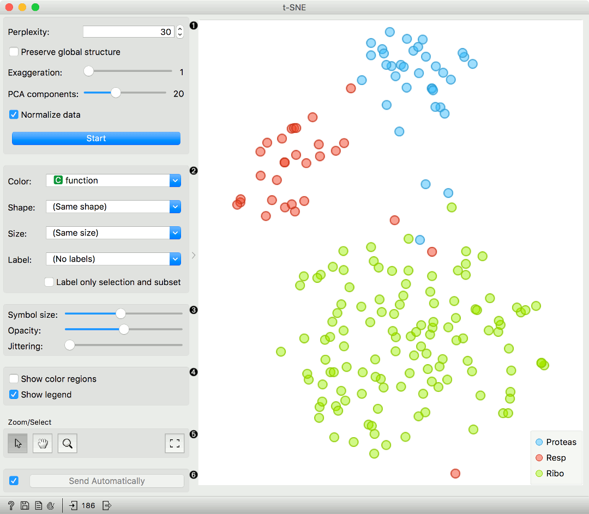
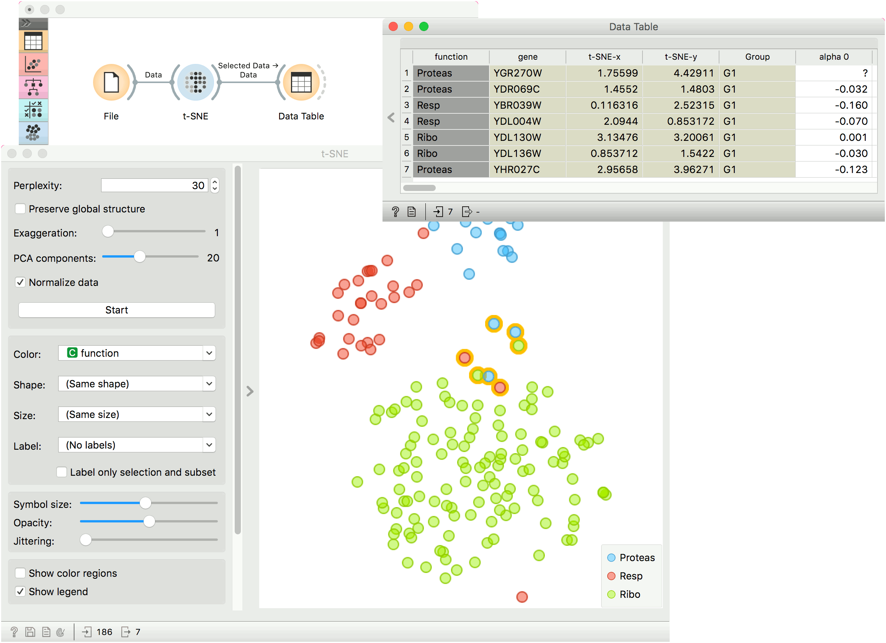
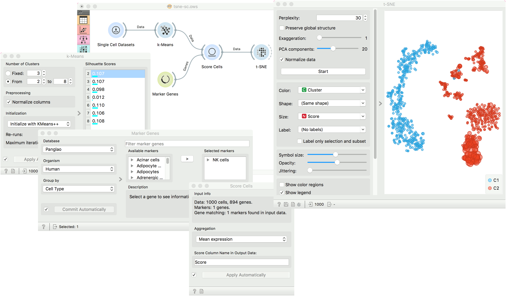

t-SNE
=====

Two-dimensional data projection with t-SNE.

**Inputs**

- Data: input dataset
- Data Subset: subset of instances

**Outputs**

- Selected Data: instances selected from the plot
- Data: data with an additional column showing whether a point is selected

The **t-SNE** widget plots the data with a t-distributed stochastic neighbor embedding method. [t-SNE](https://en.wikipedia.org/wiki/T-distributed_stochastic_neighbor_embedding) is a dimensionality reduction technique, similar to MDS, where points are mapped to 2-D space by their probability distribution.

1. [Parameters](https://opentsne.readthedocs.io/en/latest/parameters.html) for plot optimization:
   - measure of [perplexity](http://scikit-learn.org/stable/modules/generated/sklearn.manifold.TSNE.html). It can be thought of as the balance between preserving the global and the local structure of the data.
   - *Preserve global structure*: using tricks for preserving global structure.
   - *Exaggeration*: parameter which increases the attractive forces between points and allows points to move around more freely, finding their nearest neighbors more easily.
   - *PCA components*: number of PCA components to consider for initial embedding.
   - *Normalize data*: the values are replaced with standardized values by subtracting the average value and dividing by the standard deviation.
   - Press Start to (re-)run the optimization.
2. Set the color of the displayed points. Set shape, size and label to differentiate between points. If *Label only selection and subset* is ticked, only selected and/or highlighted points will be labelled.
3. Set symbol size and opacity for all data points. Set jittering to randomly disperse data points.
4. *Show color regions* colors the graph by class, while *Show legend* displays a legend on the right. Click and drag the legend to move it.
5. *Select, zoom, pan and zoom to fit* are the options for exploring the graph. The manual selection of data instances works as an angular/square selection tool. Double click to move the projection. Scroll in or out for zoom.
6. If *Send selected automatically* is ticked, changes are communicated automatically. Alternatively, press *Send Selected*.

Examples
--------

The first example is a simple t-SNE plot of *brown-selected* data set. Load *brown-selected* with the [File](../data/file.md) widget. Then connect **t-SNE** to it. The widget will show a 2D map of yeast samples, where samples with similar gene expression profiles will be close together. Select the region, where the gene function is mixed and inspect it in a [Data Table](../data/datatable.md).

For the second example, we will use [Single Cell Datasets](https://orangedatamining.com/widget-catalog/single-cell/single_cell_datasets/) widget from the Single Cell add-on to load *Bone marrow mononuclear cells with AML (sample)* data. Then we will pass it through **k-Means** and select 2 clusters from Silhouette Scores. Ok, it looks like there might be two distinct clusters here.

But can we find subpopulations in these cells? Let us load *Bone marrow mononuclear cells with AML (markers)* with **Single Cell Datasets**. Now, pass the marker genes to **Data Table** and select, for example, natural killer cells from the list (NKG7).

Pass the markers and k-Means results to [Score Cells](https://orangedatamining.com/widget-catalog/single-cell/score_cells/) widget and select *geneName* to match markers with genes. Finally, add **t-SNE** to visualize the results.

In **t-SNE**, use *Scores* attribute to color the points and set their size. We see that killer cells are nicely clustered together and that t-SNE indeed found subpopulations.

