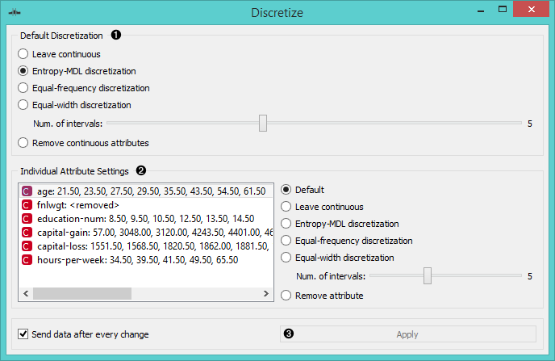

Discretize
==========

Discretizes continuous attributes from input data set.

Signals
-------

**Inputs**:

- **Data**

  Attribute-valued data set.

**Outputs**:

- **Data**

  Data set with discretized values.

Description
-----------

**Discretize** widget discretizes continuous attributes with a selected method.

1. The basic version of the widget is rather simple. It allows choosing
  between three different discretizations. 
  - **Entropy-MDL**, invented by Fayyad
  and Irani is a top-down discretization which recursively splits the
  attribute at a cut maximizing information gain, until the gain
  is lower than the minimal description length of the cut. This discretization
  can result in an arbitrary number of intervals, including a single
  interval in which case the attribute is discarded as useless (removed).
  - **Equal-frequency** splits the attribute into the a given number of intervals,
  so that they each contain approximately the same number of instances.
  - **Equal-width** evenly splits the range between the smallest and the largest
  observed value. *Number of intervals* can be set manually.
  - The widget can also be set to leave the attributes continuous or to
  remove them.

2. To treat attributes individually, go to **Individual Attribute Settings**. They show a specific 
  discretization of each attribute and allows to change it. First, the top left list shows the
  cut-off points for each attribute. In the snapshot we used the
  entropy-MDL discretization which determines the optimal number of
  intervals automatically: we can see it discretized the age into
  seven intervals with cut-offs at 21.50, 23.50, 27.50, 35.50, 43.50, 54.50 and 61.50, respectively, while the
  capital-gain got split into many intervals with several cut-offs. 
  The final weight (fnlwgt), for instance, was left with a single interval and thus removed.

  On the right we can select a specific discretization method for
  each attribute. Attribute *“fnlwgt”* would be removed by the MDL-based
  discretization, so to prevent its removal, we select the attribute and choose, for
  instance, **Equal-frequency discretization**. We could also choose to leave the attribute continuous.

3. Tick '*Send data after every change*' for the widget to automatically commit changes. Alternatively press *Apply*.

Example
-------

In the schema below we show *Iris* data set with continuous attributes (as
in original data file) and with discretized attributes.

